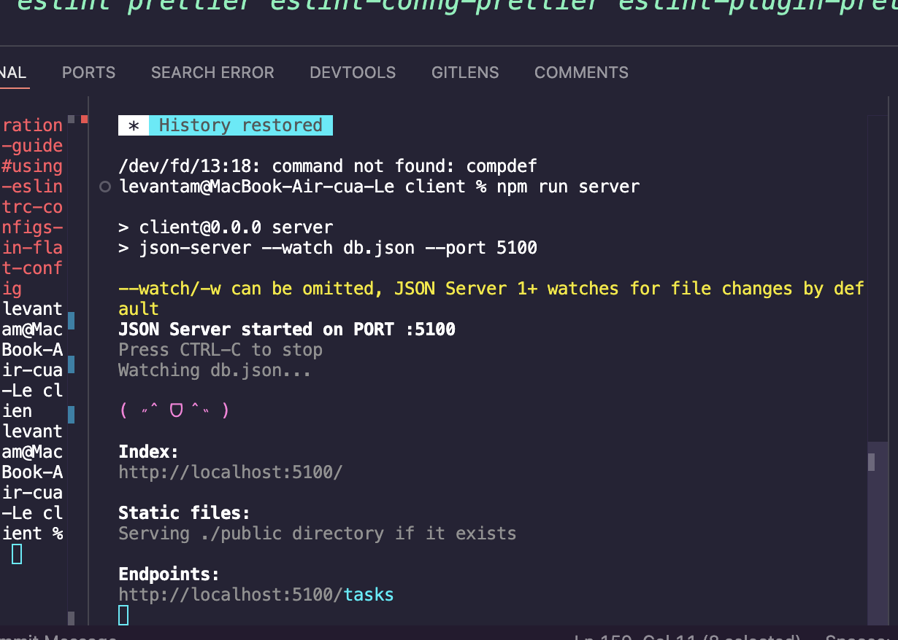
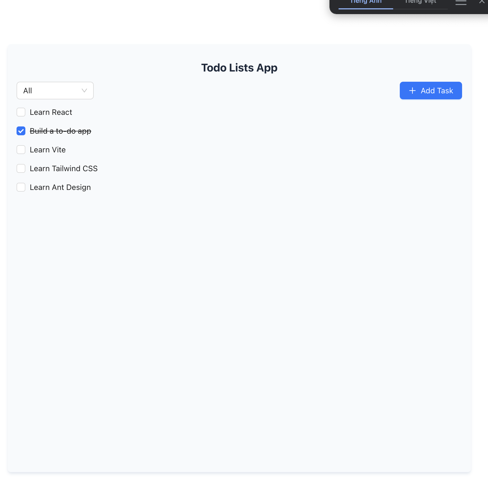
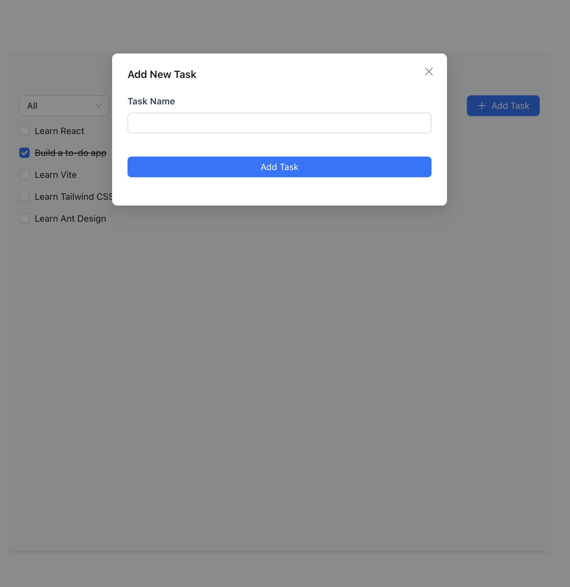
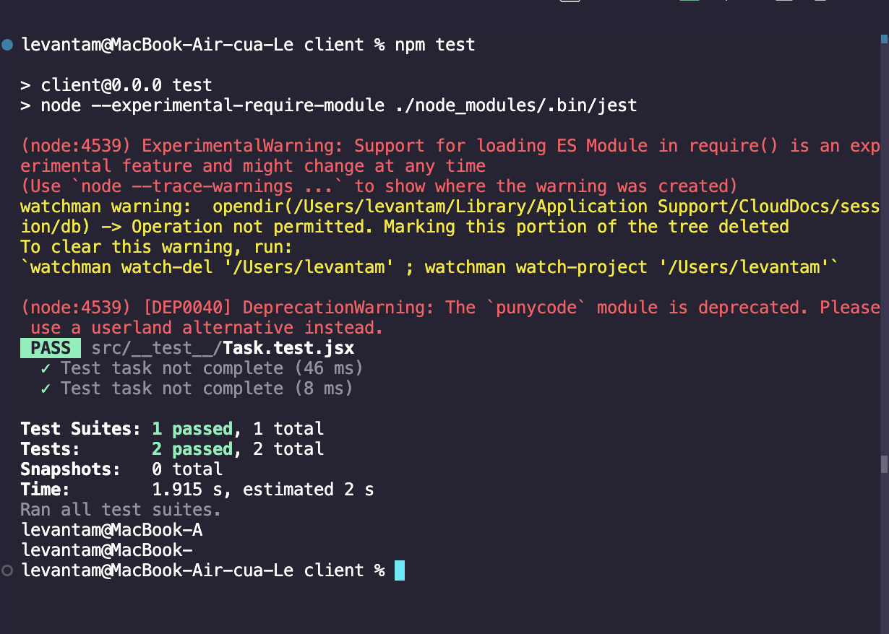

# React + Vite

================

## Start dự án

### Khởi tạo dự án bằng câu lệnh:

`npm create vite@latest`

### Các thư viện hỗ trợ

- `react`: Thư viện tạo ra các thành phần UI
- `vite`: Công cụ xây dựng và phát triển ứng dụng web nhanh chóng
- `tailwindcss`: Thư viện tạo ra các thành phần UI
- `antd`: Thư viện hỗ trợ build sẵn các component, giúp xây dựng frontend nhanh chóng

### Luồng hoạt động của Todo app

- Xây dựng giao diện người dùng
- Xây dựng các chức năng của Todo app
- Kiểm tra và debug

---

1. Tạo 1 Modal thêm các Task cần làm, khi click vào nút "Add Task" thì hiện Form add task
2. Khi thêm task thành công thì hiện ra danh sách các task
3. Khi click vào checkbox các task, thì tự động đánh dấu là "Completed"
4. Ngoài ra, còn có thể Filter theo 3 dạng: 'All', 'Incomming', 'Completed'

---

- Ở Server, sử dụng Json server để giả lập API ngay trên local
- Ở Client, sử dụng Fetch API để gọi API từ Server



### Các chức năng

1. Fetch các Tasks
   Hook `useEffect` được sử dụng để gọi API và lấy danh sách các công việc khi component được khởi tạo.

```useEffect(() => {
const fetchAPI = async () => {
const response = await getTasks();

    if (response.status === 200) {
      setTasks(response.data);
    } else {
      message.error("Đã xảy ra lỗi");
    }

};
fetchAPI();
}, []);
```

- Chức năng: Gọi API getTasks để lấy danh sách công việc và cập nhật state với dữ liệu nhận được.
- Xử lý lỗi: Hiển thị thông báo lỗi nếu yêu cầu thất bại.

2. Lọc các công việc

Hook `useMemo` được sử dụng để lọc danh sách công việc dựa trên trạng thái hoàn thành (đã hoàn thành hoặc chưa hoàn thành).

```const filteredTasks = useMemo(() => {
  return tasks.filter((task) => {
    if (filter === "completed") return task.completed;
    if (filter === "incomplete") return !task.completed;
    return true;
  });
}, [tasks, filter]);
```

- Chức năng: Lọc công việc theo trạng thái:
  "completed": Chỉ hiển thị các công việc đã hoàn thành.
  "incomplete": Chỉ hiển thị các công việc chưa hoàn thành.
  "all": Hiển thị tất cả công việc.

3. Thêm các Tasks

Hàm handleAddTask cho phép thêm một công việc mới vào danh sách.

```
const handleAddTask = useCallback(
  (title) => {
    const newTask = { title, completed: false };
    addTask(newTask).then((response) => {
      setTasks((prevTasks) => [...prevTasks, response.data]);
    });
    message.success("Thêm công việc thành công");
  },
  [addTask, setTasks]
);
```

- Chức năng: Thêm một công việc mới với tiêu đề (title) và mặc định trạng thái là chưa hoàn thành (completed: false). Sau đó, công việc mới sẽ được thêm vào danh sách công việc hiện có.
- Thông báo: Hiển thị thông báo thành công khi thêm công việc.

4. Đánh dấu Task đã hoàn thành

Hàm handleToggleComplete cho phép đánh dấu công việc là đã hoàn thành hoặc chưa hoàn thành.

```
const handleToggleComplete = useCallback(
  (taskId) => {
    setTasks((prevTasks) =>
      prevTasks.map((task) =>
        task.id === taskId ? { ...task, completed: !task.completed } : task
      )
    );
  },
  [setTasks]
);
```

- Chức năng: Đánh dấu một công việc đã hoàn thành bằng cách thay đổi trạng thái (completed) của công việc đó.

## Giao dien

1. Giao diện chinh
   

2. Giao diện mở form
   

## Kiểm thử đơn vị

1. Cài đặt các package sau:

`npm install --save-dev jest @testing-library/react @testing-library/jest-dom`

2. Tạo file `Tasks.test.js` trong thư mục `__test__`

-- Giải thích các chức năng trong test

```
afterEach(() => {
cleanup();
});
```

- `afterEach`: Hàm này được Jest gọi sau mỗi bài test để thực hiện việc dọn dẹp. Nó đảm bảo rằng không có trạng thái hoặc DOM nào của bài test trước đó ảnh hưởng đến bài test tiếp theo.
- `cleanup`: Loại bỏ DOM đã được render sau mỗi bài test.

```
test("Test task not complete", () => {
  const onToggleComplete = jest.fn();
  render(<TaskList data={data} onToggleComplete={onToggleComplete} />);
  const taskList = screen.getAllByTestId("todo-1");
  expect(taskList[0]).toBeInTheDocument();  // Kiểm tra xem phần tử đầu tiên có tồn tại trong DOM không
  expect(taskList[0]).toHaveTextContent("Task 1");
});
```

- `jest.fn()`: Tạo một hàm giả lập (mock function) để kiểm tra nếu nó được gọi đúng cách. Trong trường hợp này, hàm này không được gọi, nhưng có thể sử dụng sau này để kiểm tra hành vi của việc toggle trạng thái.
- `render`: Render component TaskList với dữ liệu giả lập data và hàm onToggleComplete.
- `screen.getAllByTestId`: Truy cập vào phần tử DOM có data-testid="todo-1" (Task 1). Phương thức này trả về một mảng các phần tử DOM.
- `expect(taskList[0]).toBeInTheDocument()`: Kiểm tra xem task đầu tiên có được render và tồn tại trong DOM không.
- `expect(taskList[0]).toHaveTextContent("Task 1")`: Kiểm tra nội dung của phần tử DOM có chứa văn bản "Task 1".



## Cấu hình Prettier và ESLint

- Cài đặt các package sau:
  `npm install --save-dev eslint prettier eslint-config-prettier eslint-plugin-prettier`

- Tạo file .prettierrc, thêm các option mà muốn format

```
{
  "semi": true,
  "singleQuote": true,
  "trailingComma": "es5",
  "tabWidth": 2,
  "printWidth": 80,
  "endOfLine": "auto"
}
```
